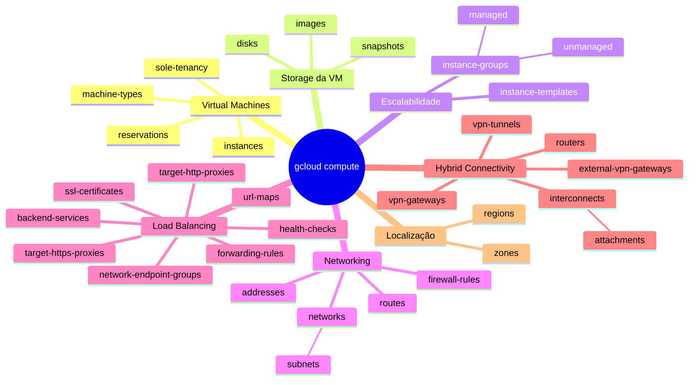

# gcloud compute

O componente `compute` concentra os comandos relacionados principalmente ao Compute Engine, networking associado, grupos de instâncias, balanceamento de carga e conectividade híbrida.

## Estrutura

```text
gcloud
└── compute
    └── ENTITY
```

## Mapa mental



## Exemplos

```bash
gcloud compute instances list
gcloud compute disks list
gcloud compute networks list
gcloud compute networks subnets list
gcloud compute instance-groups managed list
gcloud compute health-checks list
gcloud compute backend-services list
gcloud compute routers list
```

## Observação

Nem todas as entidades aparecem obrigatoriamente no mesmo nível real da CLI.

Exemplo:

```text
gcloud
└── compute
    └── networks
        └── subnets
```

e:

```text
gcloud
└── compute
    └── instance-groups
        └── managed
```
