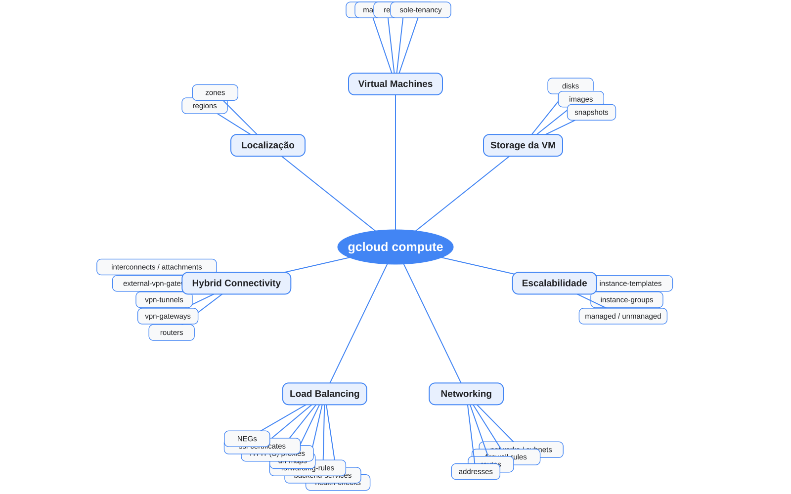

# gcloud compute



## Estrutura

```text
gcloud
└── compute
    └── ENTITY
```

## Principais grupos do mapa

- Virtual Machines
- Storage da VM
- Escalabilidade
- Networking
- Load Balancing
- Hybrid Connectivity
- Localização

## Exemplos

```bash
gcloud compute instances list
gcloud compute disks list
gcloud compute networks list
gcloud compute networks subnets list
gcloud compute instance-groups managed list
gcloud compute health-checks list
gcloud compute backend-services list
gcloud compute routers list
```

## Fonte editável

[`compute.puml`](compute.puml)
