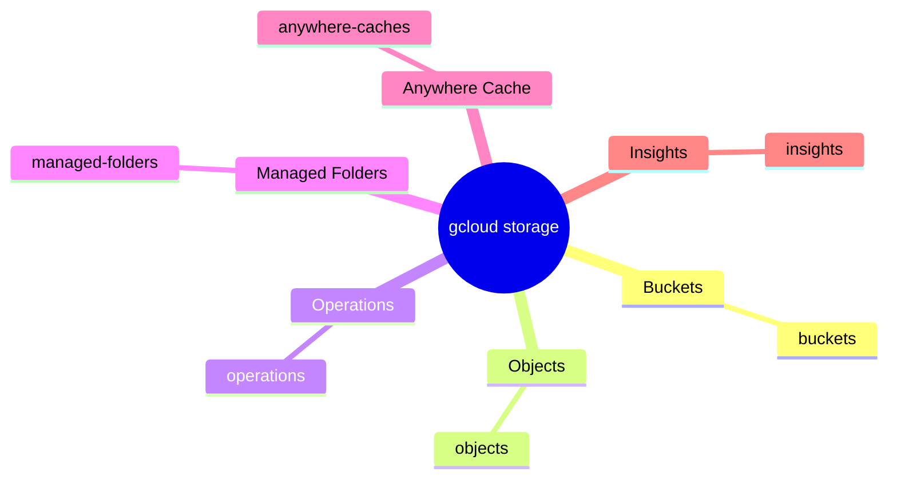

# gcloud storage

O componente `storage` reúne os comandos modernos para trabalhar com Cloud Storage por meio do `gcloud`.

## Estrutura

```text
gcloud
└── storage
    └── ENTITY
```

## Mapa mental



## Exemplos

```bash
gcloud storage buckets list
gcloud storage buckets describe gs://MEU_BUCKET

gcloud storage objects list gs://MEU_BUCKET
gcloud storage objects describe gs://MEU_BUCKET/arquivo.txt

gcloud storage managed-folders list gs://MEU_BUCKET
gcloud storage operations list
```

## Comandos muito usados

Embora `buckets` e `objects` sejam as entidades mais importantes para visualizar a estrutura do componente, o `gcloud storage` também possui operações diretas muito usadas, por exemplo:

```bash
gcloud storage ls
gcloud storage cp arquivo.txt gs://MEU_BUCKET
gcloud storage mv arquivo.txt gs://MEU_BUCKET
gcloud storage rm gs://MEU_BUCKET/arquivo.txt
gcloud storage rsync ./dados gs://MEU_BUCKET/dados
```

Essas operações não precisam ser representadas como ENTITY no mapa mental, pois o objetivo deste repositório é destacar principalmente a hierarquia:

```text
gcloud COMPONENT ENTITY
```
