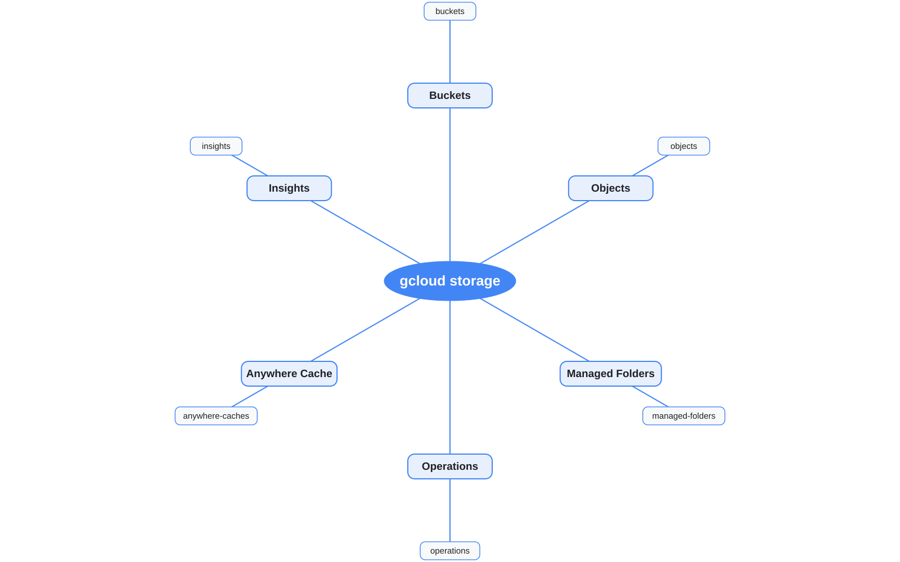

# gcloud storage



## Estrutura

```text
gcloud
└── storage
    └── ENTITY
```

## Principais grupos do mapa

- Buckets
- Objects
- Managed Folders
- Operations
- Anywhere Cache
- Insights

## Exemplos

```bash
gcloud storage buckets list
gcloud storage objects list gs://MEU_BUCKET
gcloud storage managed-folders list gs://MEU_BUCKET
gcloud storage operations list
```

Operações diretas como `ls`, `cp`, `mv`, `rm` e `rsync` são importantes, mas ficam fora do mapa porque o objetivo principal é destacar `COMPONENT → ENTITY`.

## Fonte editável

[`storage.puml`](storage.puml)
