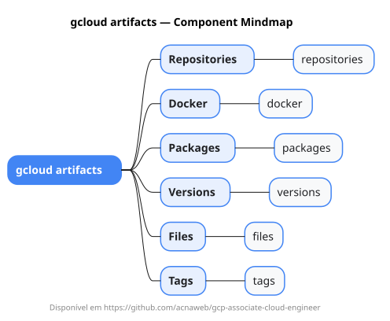

# gcloud artifacts

Mapa mental do component `artifacts`.

## Diagrama

## Fonte PlantUML

[artifacts.puml](./artifacts.puml)

## Entities / subgrupos representados

- `repositories`
- `docker`
- `packages`
- `versions`
- `files`
- `tags`

> O mapa prioriza os grupos e entidades mais úteis para estudo e navegação mental da CLI. Alguns nós podem representar subgrupos intermediários da árvore real do `gcloud`.
