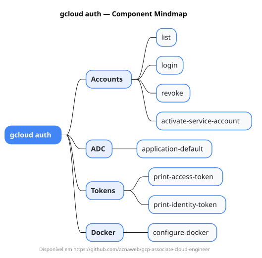

# gcloud auth

Mapa mental do component `auth`.

## Diagrama

## Fonte PlantUML

[auth.puml](./auth.puml)

## Entities / subgrupos representados

- `list`
- `login`
- `revoke`
- `activate-service-account`
- `application-default`
- `print-access-token`
- `print-identity-token`
- `configure-docker`

> O mapa prioriza os grupos e entidades mais úteis para estudo e navegação mental da CLI. Alguns nós podem representar subgrupos intermediários da árvore real do `gcloud`.
