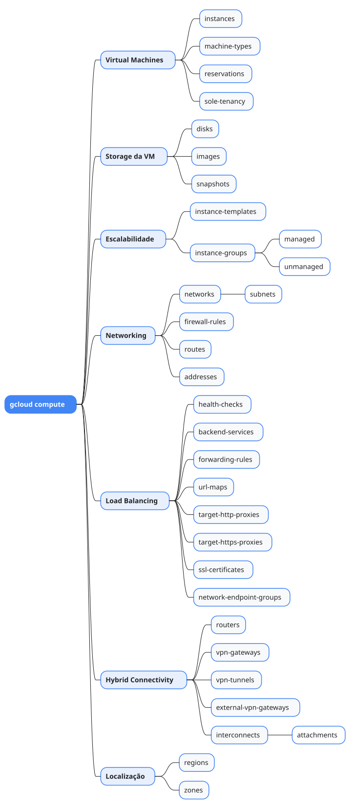

# gcloud compute

Mapa mental do component `compute`.

## Diagrama

## Fonte PlantUML

[compute.puml](./compute.puml)

## Entities / subgrupos representados

- `instances`
- `machine-types`
- `reservations`
- `sole-tenancy`
- `disks`
- `images`
- `snapshots`
- `instance-templates`
- `instance-groups`
- `managed`
- `unmanaged`
- `networks`
- `subnets`
- `firewall-rules`
- `routes`
- `addresses`
- `health-checks`
- `backend-services`
- `forwarding-rules`
- `url-maps`
- `target-http-proxies`
- `target-https-proxies`
- `ssl-certificates`
- `network-endpoint-groups`
- `routers`
- `vpn-gateways`
- `vpn-tunnels`
- `external-vpn-gateways`
- `interconnects`
- `attachments`
- `regions`
- `zones`

> O mapa prioriza os grupos e entidades mais úteis para estudo e navegação mental da CLI. Alguns nós podem representar subgrupos intermediários da árvore real do `gcloud`.
