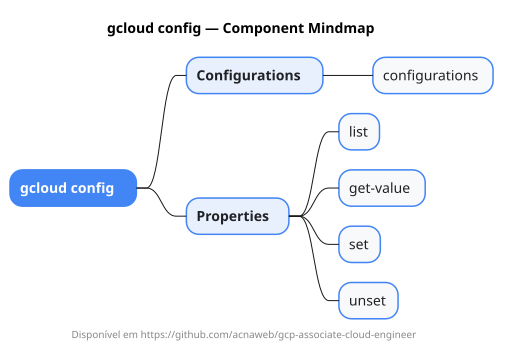

# gcloud config

Mapa mental do component `config`.

## Diagrama

## Fonte PlantUML

[config.puml](./config.puml)

## Entities / subgrupos representados

- `configurations`
- `list`
- `get-value`
- `set`
- `unset`

> O mapa prioriza os grupos e entidades mais úteis para estudo e navegação mental da CLI. Alguns nós podem representar subgrupos intermediários da árvore real do `gcloud`.
