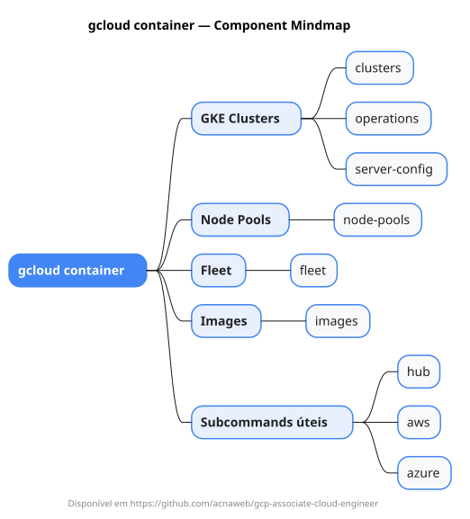

# gcloud container

Mapa mental do component `container`.

## Diagrama

## Fonte PlantUML

[container.puml](./container.puml)

## Entities / subgrupos representados

- `clusters`
- `operations`
- `server-config`
- `node-pools`
- `fleet`
- `images`
- `hub`
- `aws`
- `azure`

> O mapa prioriza os grupos e entidades mais úteis para estudo e navegação mental da CLI. Alguns nós podem representar subgrupos intermediários da árvore real do `gcloud`.
