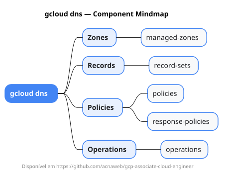

# gcloud dns

Mapa mental do component `dns`.

## Diagrama

## Fonte PlantUML

[dns.puml](./dns.puml)

## Entities / subgrupos representados

- `managed-zones`
- `record-sets`
- `policies`
- `response-policies`
- `operations`

> O mapa prioriza os grupos e entidades mais úteis para estudo e navegação mental da CLI. Alguns nós podem representar subgrupos intermediários da árvore real do `gcloud`.
