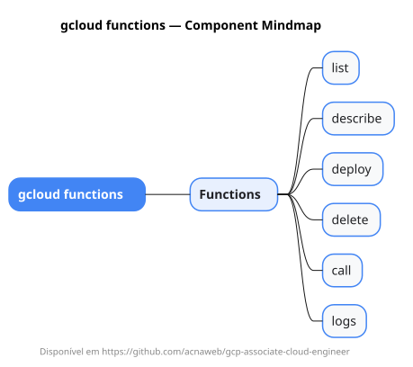

# gcloud functions

Mapa mental do component `functions`.

## Diagrama

## Fonte PlantUML

[functions.puml](./functions.puml)

## Entities / subgrupos representados

- `list`
- `describe`
- `deploy`
- `delete`
- `call`
- `logs`

> O mapa prioriza os grupos e entidades mais úteis para estudo e navegação mental da CLI. Alguns nós podem representar subgrupos intermediários da árvore real do `gcloud`.
