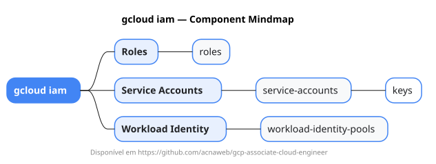

# gcloud iam

Mapa mental do component `iam`.

## Diagrama

## Fonte PlantUML

[iam.puml](./iam.puml)

## Entities / subgrupos representados

- `roles`
- `service-accounts`
- `keys`
- `workload-identity-pools`

> O mapa prioriza os grupos e entidades mais úteis para estudo e navegação mental da CLI. Alguns nós podem representar subgrupos intermediários da árvore real do `gcloud`.
