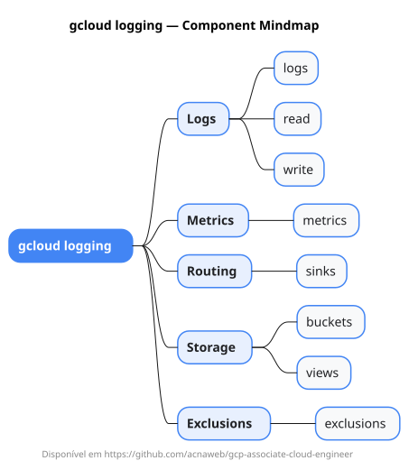

# gcloud logging

Mapa mental do component `logging`.

## Diagrama

## Fonte PlantUML

[logging.puml](./logging.puml)

## Entities / subgrupos representados

- `logs`
- `read`
- `write`
- `metrics`
- `sinks`
- `buckets`
- `views`
- `exclusions`

> O mapa prioriza os grupos e entidades mais úteis para estudo e navegação mental da CLI. Alguns nós podem representar subgrupos intermediários da árvore real do `gcloud`.
