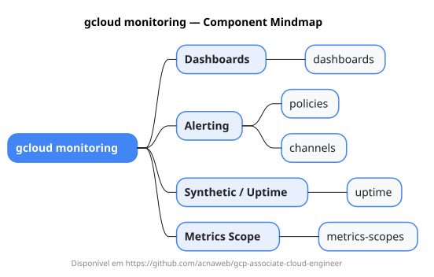

# gcloud monitoring

Mapa mental do component `monitoring`.

## Diagrama

## Fonte PlantUML

[monitoring.puml](./monitoring.puml)

## Entities / subgrupos representados

- `dashboards`
- `policies`
- `channels`
- `uptime`
- `metrics-scopes`

> O mapa prioriza os grupos e entidades mais úteis para estudo e navegação mental da CLI. Alguns nós podem representar subgrupos intermediários da árvore real do `gcloud`.
