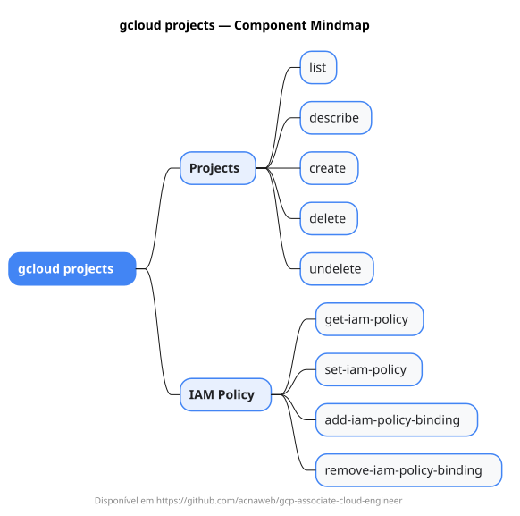

# gcloud projects

Mapa mental do component `projects`.

## Diagrama

## Fonte PlantUML

[projects.puml](./projects.puml)

## Entities / subgrupos representados

- `list`
- `describe`
- `create`
- `delete`
- `undelete`
- `get-iam-policy`
- `set-iam-policy`
- `add-iam-policy-binding`
- `remove-iam-policy-binding`

> O mapa prioriza os grupos e entidades mais úteis para estudo e navegação mental da CLI. Alguns nós podem representar subgrupos intermediários da árvore real do `gcloud`.
