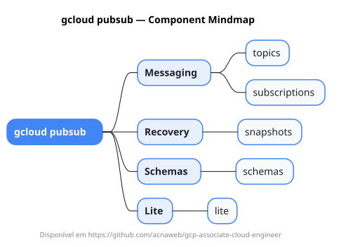

# gcloud pubsub

Mapa mental do component `pubsub`.

## Diagrama

## Fonte PlantUML

[pubsub.puml](./pubsub.puml)

## Entities / subgrupos representados

- `topics`
- `subscriptions`
- `snapshots`
- `schemas`
- `lite`

> O mapa prioriza os grupos e entidades mais úteis para estudo e navegação mental da CLI. Alguns nós podem representar subgrupos intermediários da árvore real do `gcloud`.
