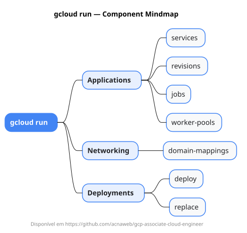

# gcloud run

Mapa mental do component `run`.

## Diagrama

## Fonte PlantUML

[run.puml](./run.puml)

## Entities / subgrupos representados

- `services`
- `revisions`
- `jobs`
- `worker-pools`
- `domain-mappings`
- `deploy`
- `replace`

> O mapa prioriza os grupos e entidades mais úteis para estudo e navegação mental da CLI. Alguns nós podem representar subgrupos intermediários da árvore real do `gcloud`.
