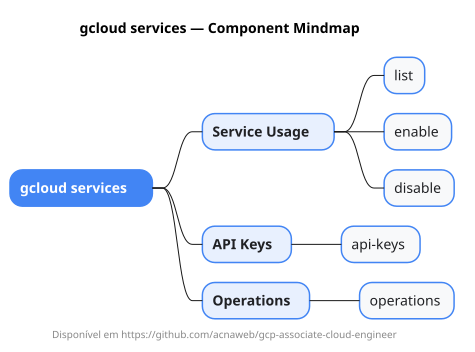

# gcloud services

Mapa mental do component `services`.

## Diagrama

## Fonte PlantUML

[services.puml](./services.puml)

## Entities / subgrupos representados

- `list`
- `enable`
- `disable`
- `api-keys`
- `operations`

> O mapa prioriza os grupos e entidades mais úteis para estudo e navegação mental da CLI. Alguns nós podem representar subgrupos intermediários da árvore real do `gcloud`.
