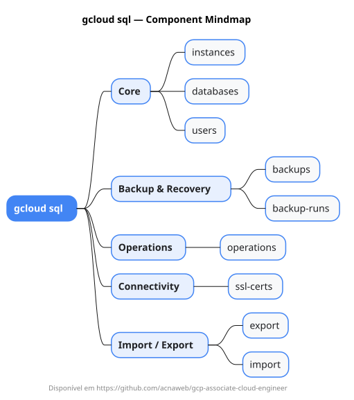

# gcloud sql

Mapa mental do component `sql`.

## Diagrama

## Fonte PlantUML

[sql.puml](./sql.puml)

## Entities / subgrupos representados

- `instances`
- `databases`
- `users`
- `backups`
- `backup-runs`
- `operations`
- `ssl-certs`
- `export`
- `import`

> O mapa prioriza os grupos e entidades mais úteis para estudo e navegação mental da CLI. Alguns nós podem representar subgrupos intermediários da árvore real do `gcloud`.
