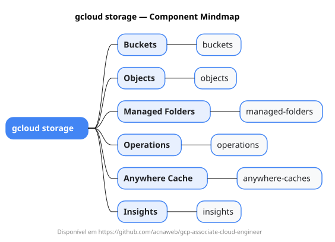

# gcloud storage

Mapa mental do component `storage`.

## Diagrama



## Fonte PlantUML

[storage.puml](./storage.puml)

## Estrutura principal

```text
gcloud
└── storage
    ├── buckets
    ├── objects
    ├── managed-folders
    ├── operations
    ├── anywhere-caches
    └── insights
```
