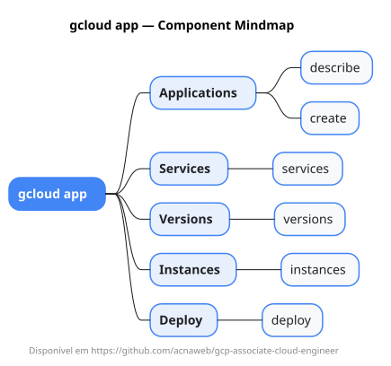

# gcloud app

Mapa mental do component `app`.

## Diagrama

## Fonte PlantUML

[app.puml](./app.puml)

## Entities / subgrupos representados

- `describe`
- `create`
- `services`
- `versions`
- `instances`
- `deploy`

> O mapa prioriza os grupos e entidades mais úteis para estudo e navegação mental da CLI. Alguns nós podem representar subgrupos intermediários da árvore real do `gcloud`.
