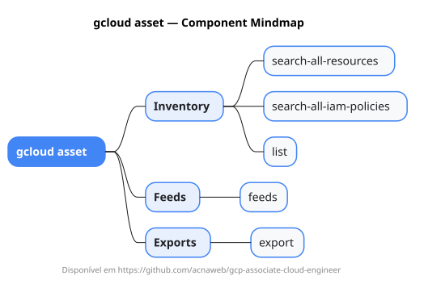

# gcloud asset

Mapa mental do component `asset`.

## Diagrama

## Fonte PlantUML

[asset.puml](./asset.puml)

## Entities / subgrupos representados

- `search-all-resources`
- `search-all-iam-policies`
- `list`
- `feeds`
- `export`

> O mapa prioriza os grupos e entidades mais úteis para estudo e navegação mental da CLI. Alguns nós podem representar subgrupos intermediários da árvore real do `gcloud`.
