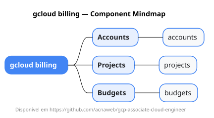

# gcloud billing

Mapa mental do component `billing`.

## Diagrama

## Fonte PlantUML

[billing.puml](./billing.puml)

## Entities / subgrupos representados

- `accounts`
- `projects`
- `budgets`

> O mapa prioriza os grupos e entidades mais úteis para estudo e navegação mental da CLI. Alguns nós podem representar subgrupos intermediários da árvore real do `gcloud`.
