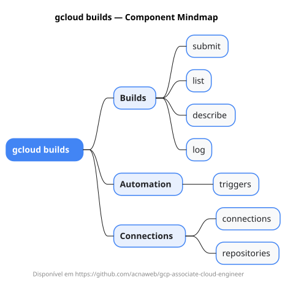

# gcloud builds

Mapa mental do component `builds`.

## Diagrama

## Fonte PlantUML

[builds.puml](./builds.puml)

## Entities / subgrupos representados

- `submit`
- `list`
- `describe`
- `log`
- `triggers`
- `connections`
- `repositories`

> O mapa prioriza os grupos e entidades mais úteis para estudo e navegação mental da CLI. Alguns nós podem representar subgrupos intermediários da árvore real do `gcloud`.
