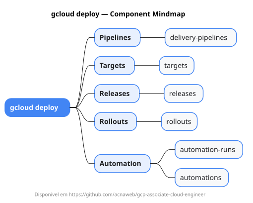

# gcloud deploy

Mapa mental do component `deploy`.

## Diagrama

## Fonte PlantUML

[deploy.puml](./deploy.puml)

## Entities / subgrupos representados

- `delivery-pipelines`
- `targets`
- `releases`
- `rollouts`
- `automation-runs`
- `automations`

> O mapa prioriza os grupos e entidades mais úteis para estudo e navegação mental da CLI. Alguns nós podem representar subgrupos intermediários da árvore real do `gcloud`.
