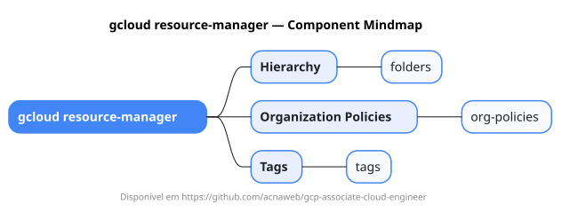

# gcloud resource-manager

Mapa mental do component `resource-manager`.

## Diagrama

## Fonte PlantUML

[resource-manager.puml](./resource-manager.puml)

## Entities / subgrupos representados

- `folders`
- `org-policies`
- `tags`

> O mapa prioriza os grupos e entidades mais úteis para estudo e navegação mental da CLI. Alguns nós podem representar subgrupos intermediários da árvore real do `gcloud`.
