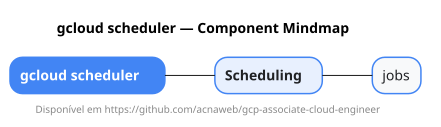

# gcloud scheduler

Mapa mental do component `scheduler`.

## Diagrama

## Fonte PlantUML

[scheduler.puml](./scheduler.puml)

## Entities / subgrupos representados

- `jobs`

> O mapa prioriza os grupos e entidades mais úteis para estudo e navegação mental da CLI. Alguns nós podem representar subgrupos intermediários da árvore real do `gcloud`.
