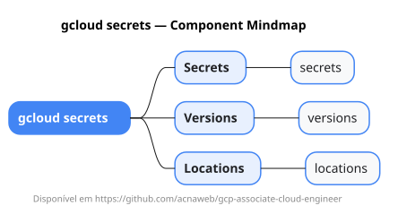

# gcloud secrets

Mapa mental do component `secrets`.

## Diagrama

## Fonte PlantUML

[secrets.puml](./secrets.puml)

## Entities / subgrupos representados

- `secrets`
- `versions`
- `locations`

> O mapa prioriza os grupos e entidades mais úteis para estudo e navegação mental da CLI. Alguns nós podem representar subgrupos intermediários da árvore real do `gcloud`.
