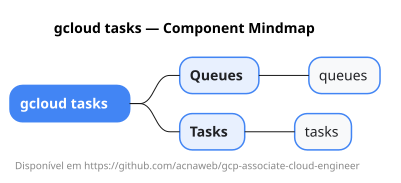

# gcloud tasks

Mapa mental do component `tasks`.

## Diagrama

## Fonte PlantUML

[tasks.puml](./tasks.puml)

## Entities / subgrupos representados

- `queues`
- `tasks`

> O mapa prioriza os grupos e entidades mais úteis para estudo e navegação mental da CLI. Alguns nós podem representar subgrupos intermediários da árvore real do `gcloud`.
