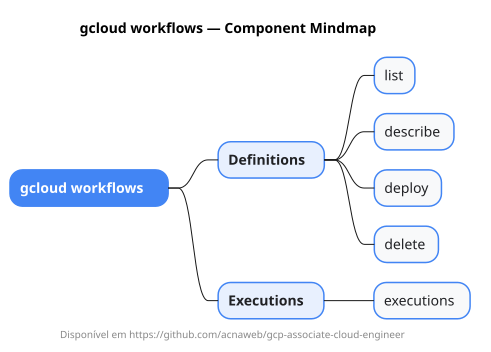

# gcloud workflows

Mapa mental do component `workflows`.

## Diagrama

## Fonte PlantUML

[workflows.puml](./workflows.puml)

## Entities / subgrupos representados

- `list`
- `describe`
- `deploy`
- `delete`
- `executions`

> O mapa prioriza os grupos e entidades mais úteis para estudo e navegação mental da CLI. Alguns nós podem representar subgrupos intermediários da árvore real do `gcloud`.
