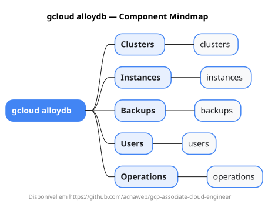

# gcloud alloydb

Mapa mental do component `alloydb`.

## Diagrama

## Fonte PlantUML

[alloydb.puml](./alloydb.puml)

## Entities / subgrupos representados

- `clusters`
- `instances`
- `backups`
- `users`
- `operations`

> O mapa prioriza os grupos e entidades mais úteis para estudo e navegação mental da CLI. Alguns nós podem representar subgrupos intermediários da árvore real do `gcloud`.
