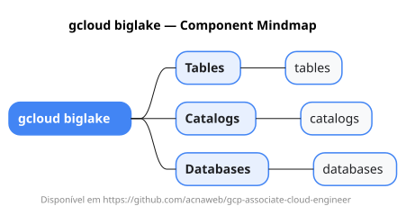

# gcloud biglake

Mapa mental do component `biglake`.

## Diagrama

## Fonte PlantUML

[biglake.puml](./biglake.puml)

## Entities / subgrupos representados

- `tables`
- `catalogs`
- `databases`

> O mapa prioriza os grupos e entidades mais úteis para estudo e navegação mental da CLI. Alguns nós podem representar subgrupos intermediários da árvore real do `gcloud`.
