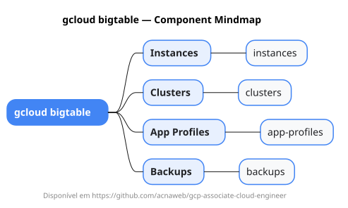

# gcloud bigtable

Mapa mental do component `bigtable`.

## Diagrama

## Fonte PlantUML

[bigtable.puml](./bigtable.puml)

## Entities / subgrupos representados

- `instances`
- `clusters`
- `app-profiles`
- `backups`

> O mapa prioriza os grupos e entidades mais úteis para estudo e navegação mental da CLI. Alguns nós podem representar subgrupos intermediários da árvore real do `gcloud`.
