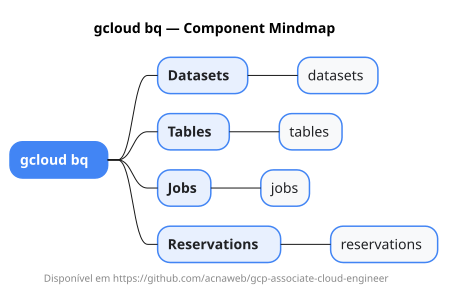

# gcloud bq

Mapa mental do component `bq`.

## Diagrama

## Fonte PlantUML

[bq.puml](./bq.puml)

## Entities / subgrupos representados

- `datasets`
- `tables`
- `jobs`
- `reservations`

> O mapa prioriza os grupos e entidades mais úteis para estudo e navegação mental da CLI. Alguns nós podem representar subgrupos intermediários da árvore real do `gcloud`.
