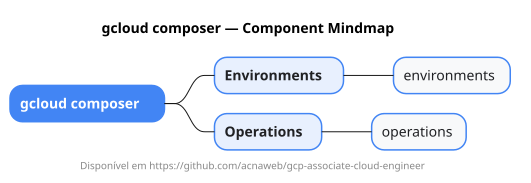

# gcloud composer

Mapa mental do component `composer`.

## Diagrama

## Fonte PlantUML

[composer.puml](./composer.puml)

## Entities / subgrupos representados

- `environments`
- `operations`

> O mapa prioriza os grupos e entidades mais úteis para estudo e navegação mental da CLI. Alguns nós podem representar subgrupos intermediários da árvore real do `gcloud`.
