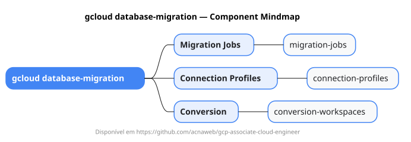

# gcloud database-migration

Mapa mental do component `database-migration`.

## Diagrama

## Fonte PlantUML

[database-migration.puml](./database-migration.puml)

## Entities / subgrupos representados

- `migration-jobs`
- `connection-profiles`
- `conversion-workspaces`

> O mapa prioriza os grupos e entidades mais úteis para estudo e navegação mental da CLI. Alguns nós podem representar subgrupos intermediários da árvore real do `gcloud`.
