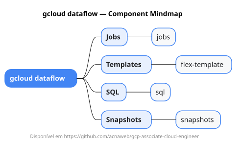

# gcloud dataflow

Mapa mental do component `dataflow`.

## Diagrama

## Fonte PlantUML

[dataflow.puml](./dataflow.puml)

## Entities / subgrupos representados

- `jobs`
- `flex-template`
- `sql`
- `snapshots`

> O mapa prioriza os grupos e entidades mais úteis para estudo e navegação mental da CLI. Alguns nós podem representar subgrupos intermediários da árvore real do `gcloud`.
