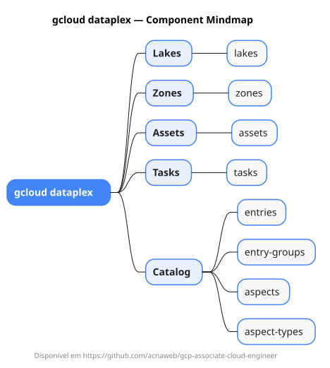

# gcloud dataplex

Mapa mental do component `dataplex`.

## Diagrama

## Fonte PlantUML

[dataplex.puml](./dataplex.puml)

## Entities / subgrupos representados

- `lakes`
- `zones`
- `assets`
- `tasks`
- `entries`
- `entry-groups`
- `aspects`
- `aspect-types`

> O mapa prioriza os grupos e entidades mais úteis para estudo e navegação mental da CLI. Alguns nós podem representar subgrupos intermediários da árvore real do `gcloud`.
