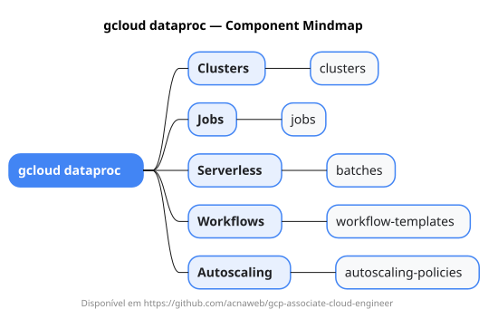

# gcloud dataproc

Mapa mental do component `dataproc`.

## Diagrama

## Fonte PlantUML

[dataproc.puml](./dataproc.puml)

## Entities / subgrupos representados

- `clusters`
- `jobs`
- `batches`
- `workflow-templates`
- `autoscaling-policies`

> O mapa prioriza os grupos e entidades mais úteis para estudo e navegação mental da CLI. Alguns nós podem representar subgrupos intermediários da árvore real do `gcloud`.
