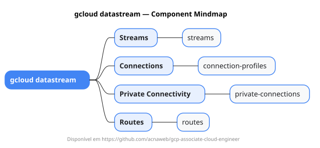

# gcloud datastream

Mapa mental do component `datastream`.

## Diagrama

## Fonte PlantUML

[datastream.puml](./datastream.puml)

## Entities / subgrupos representados

- `streams`
- `connection-profiles`
- `private-connections`
- `routes`

> O mapa prioriza os grupos e entidades mais úteis para estudo e navegação mental da CLI. Alguns nós podem representar subgrupos intermediários da árvore real do `gcloud`.
