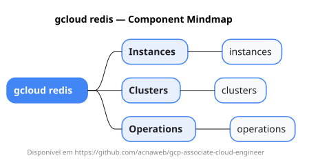

# gcloud redis

Mapa mental do component `redis`.

## Diagrama

## Fonte PlantUML

[redis.puml](./redis.puml)

## Entities / subgrupos representados

- `instances`
- `clusters`
- `operations`

> O mapa prioriza os grupos e entidades mais úteis para estudo e navegação mental da CLI. Alguns nós podem representar subgrupos intermediários da árvore real do `gcloud`.
