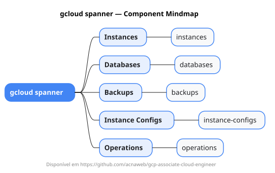

# gcloud spanner

Mapa mental do component `spanner`.

## Diagrama

## Fonte PlantUML

[spanner.puml](./spanner.puml)

## Entities / subgrupos representados

- `instances`
- `databases`
- `backups`
- `instance-configs`
- `operations`

> O mapa prioriza os grupos e entidades mais úteis para estudo e navegação mental da CLI. Alguns nós podem representar subgrupos intermediários da árvore real do `gcloud`.
