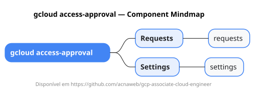

# gcloud access-approval

Mapa mental do component `access-approval`.

## Diagrama

## Fonte PlantUML

[access-approval.puml](./access-approval.puml)

## Entities / subgrupos representados

- `requests`
- `settings`

> O mapa prioriza os grupos e entidades mais úteis para estudo e navegação mental da CLI. Alguns nós podem representar subgrupos intermediários da árvore real do `gcloud`.
