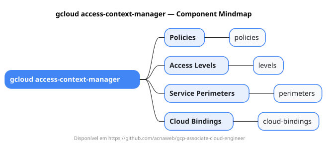

# gcloud access-context-manager

Mapa mental do component `access-context-manager`.

## Diagrama

## Fonte PlantUML

[access-context-manager.puml](./access-context-manager.puml)

## Entities / subgrupos representados

- `policies`
- `levels`
- `perimeters`
- `cloud-bindings`

> O mapa prioriza os grupos e entidades mais úteis para estudo e navegação mental da CLI. Alguns nós podem representar subgrupos intermediários da árvore real do `gcloud`.
