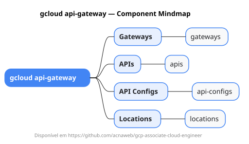

# gcloud api-gateway

Mapa mental do component `api-gateway`.

## Diagrama

## Fonte PlantUML

[api-gateway.puml](./api-gateway.puml)

## Entities / subgrupos representados

- `gateways`
- `apis`
- `api-configs`
- `locations`

> O mapa prioriza os grupos e entidades mais úteis para estudo e navegação mental da CLI. Alguns nós podem representar subgrupos intermediários da árvore real do `gcloud`.
