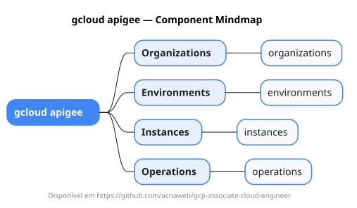

# gcloud apigee

Mapa mental do component `apigee`.

## Diagrama

## Fonte PlantUML

[apigee.puml](./apigee.puml)

## Entities / subgrupos representados

- `organizations`
- `environments`
- `instances`
- `operations`

> O mapa prioriza os grupos e entidades mais úteis para estudo e navegação mental da CLI. Alguns nós podem representar subgrupos intermediários da árvore real do `gcloud`.
