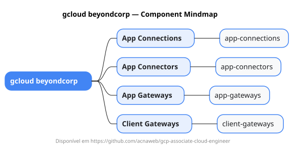

# gcloud beyondcorp

Mapa mental do component `beyondcorp`.

## Diagrama

## Fonte PlantUML

[beyondcorp.puml](./beyondcorp.puml)

## Entities / subgrupos representados

- `app-connections`
- `app-connectors`
- `app-gateways`
- `client-gateways`

> O mapa prioriza os grupos e entidades mais úteis para estudo e navegação mental da CLI. Alguns nós podem representar subgrupos intermediários da árvore real do `gcloud`.
