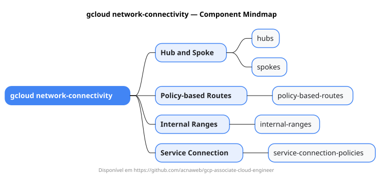

# gcloud network-connectivity

Mapa mental do component `network-connectivity`.

## Diagrama

## Fonte PlantUML

[network-connectivity.puml](./network-connectivity.puml)

## Entities / subgrupos representados

- `hubs`
- `spokes`
- `policy-based-routes`
- `internal-ranges`
- `service-connection-policies`

> O mapa prioriza os grupos e entidades mais úteis para estudo e navegação mental da CLI. Alguns nós podem representar subgrupos intermediários da árvore real do `gcloud`.
