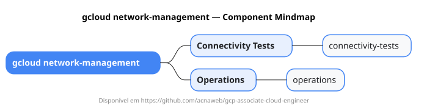

# gcloud network-management

Mapa mental do component `network-management`.

## Diagrama

## Fonte PlantUML

[network-management.puml](./network-management.puml)

## Entities / subgrupos representados

- `connectivity-tests`
- `operations`

> O mapa prioriza os grupos e entidades mais úteis para estudo e navegação mental da CLI. Alguns nós podem representar subgrupos intermediários da árvore real do `gcloud`.
