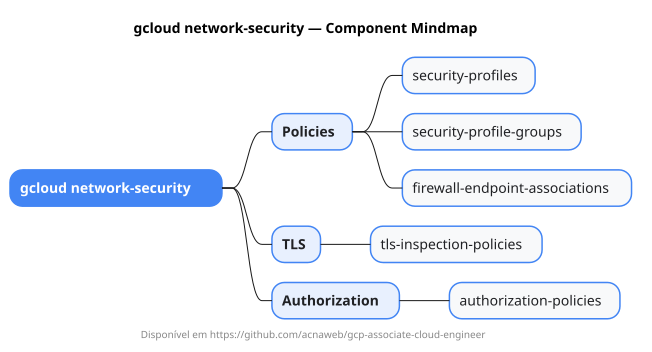

# gcloud network-security

Mapa mental do component `network-security`.

## Diagrama

## Fonte PlantUML

[network-security.puml](./network-security.puml)

## Entities / subgrupos representados

- `security-profiles`
- `security-profile-groups`
- `firewall-endpoint-associations`
- `tls-inspection-policies`
- `authorization-policies`

> O mapa prioriza os grupos e entidades mais úteis para estudo e navegação mental da CLI. Alguns nós podem representar subgrupos intermediários da árvore real do `gcloud`.
